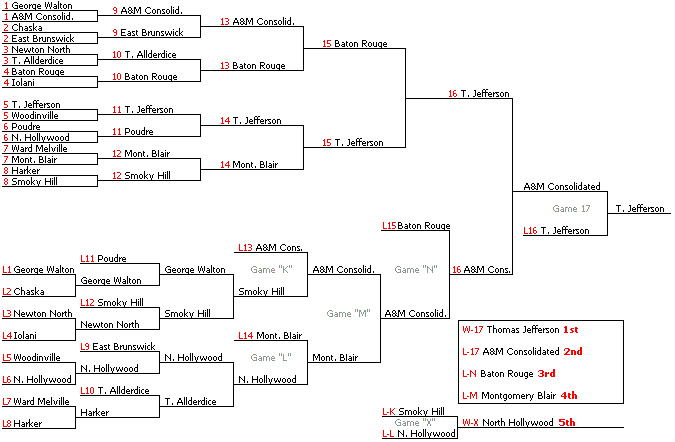

# Турнирная система с выбыванием после двух поражений

## Требования
 - Число участников должно быть степенью двойки. Если число участников
 отличается от правильного, можно применить эту схему турнира с добавлением
 фиктивных участников.

## Описание

Турнир разделён на две сетки — верхнюю и нижнюю (сетку победителей и сетку проигравших) 
Все участники начинают турнир в верхней сетке. Первоначальное формирование пар
произвоиться автоматически(случайно или по рейтингу) или в ручную.

## Правила

1. Победители первого тура выходят во второй тур верхней сетки. Проигравшие переходят в нижнюю сетку.
2. В нижней сетке турнир начинается со второго тура. Отбор пар второго и следующих 
туров может быть построен либо «по жёсткой сетке» (сетки турнира формируются заранее 
и однозначно задают формирование пар), либо отбором по игровым результатам в 
данном турнире (очкам, баллам, разнице забитых и пропущенных и так далее), 
либо снова по жребию, с обязательным ограничением: никто не должен играть с одним 
и тем же соперником дважды.
3. Начиная со второго тура, игра проводится одновременно в обеих сетках: 
  - Выигравший в верхней сетке переходит в следующий тур в ней же.
  - Проигравший в верхней сетке переходит в следующий тур в нижней сетке.
  - Выигравший в нижней сетке переходит в следующий тур в ней же.
  - Проигравший в нижней сетке выбывает из турнира.
4. Игры в обеих сетках проводятся, в зависимости от регламента, до «правила 1-2» 
(когда в верхней сетке остаётся один участник, в нижней — два или более) или 
до «правила 2-2» (в верхней сетке — два игрока, в нижней — два или более). 
(«правила» разработаны для лучшего запоминания судьями).

