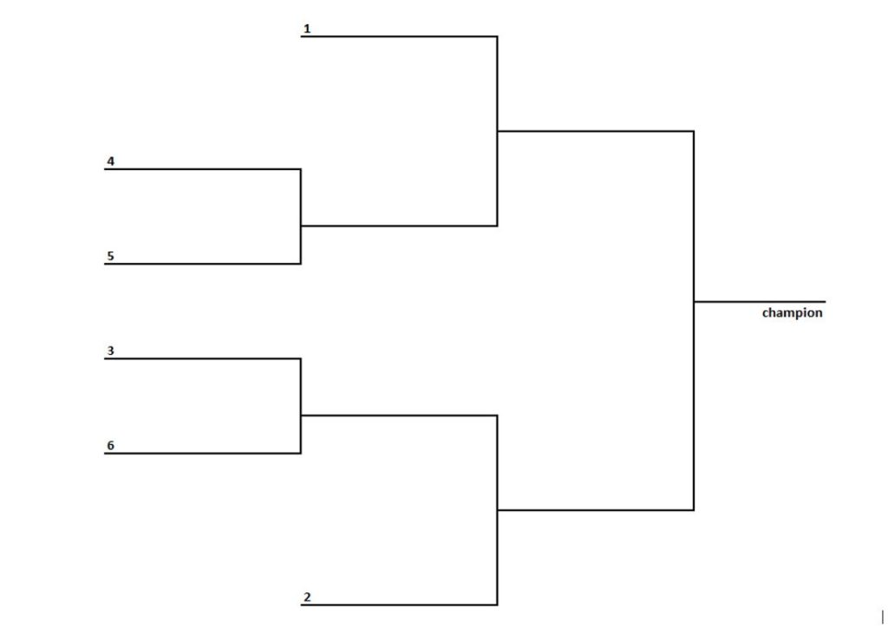

# Олимпийская система или play-off

## Описание
Cистема розыгрыша (организации соревнований), при которой участник выбывает из турнира после первого же проигрыша (по итогам одной игры или серии из нескольких игр между двумя участниками, позволяющей однозначно определить безусловного победителя). Обеспечивает выявление победителя за минимальное число туров и способствует напряжённой борьбе в турнире.

## Правила
 - В каждом круге из участников составляются пары, играющие между собой (это может быть одна игра, или матч из нескольких игр, в котором побеждает набравший больше очков; принципиально важно, что результат тура всегда определённый — ничьих быть не может).
 - Количество участников розыгрыша олимпийской системы обязательно должно быть степенью двойки.
 - В случае другого числа команд проводятся один или несколько предварительных кругов розыгрыша, в результате которых общее число участников сокращается до ближайшей степени двойки. Во многих видах спорта этот предварительный этап именуется «регулярным сезоном». В индивидуальных видах спорта, где практикуется присваивание игрокам личных рейтингов, возможен отбор в плей-офф нужного количества игроков с наибольшим на момент отбора рейтингом.
 - Из каждой пары в следующий круг выходит победитель, а побеждённый выбывает из турнира.
 - Участник, выигравший финальный круг, становится победителем, его последний соперник получает второе место. Если регламент турнира требует присвоения и третьего места, то проводится дополнительный матч за него между двумя участниками, проигравшими в двух полуфиналах.

